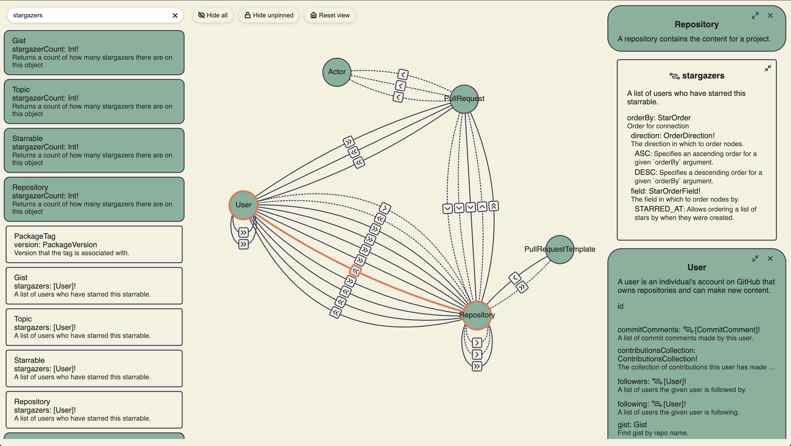

[](https://github.com/domain-graph/domain-graph/actions?query=workflow%3Abuild+branch%3Amaster+event%3Apush)
[](https://www.npmjs.com/package/domain-graph)

# DomainGraph

Beautiful, interactive visualizations for GraphQL schemas



## Quick Start

Import the script and styles from [unpkg](https://unpkg.com/) and mount your schema:

```html
<html>
  <head>
    <script src="https://unpkg.com/domain-graph/umd/domain-graph.min.js"></script>
    <link
      href="https://unpkg.com/domain-graph/umd/domain-graph.min.css"
      rel="stylesheet"
    />
  </head>
  <body>
    <div id="app-root"></div>
    <script>
      var schema = 'type MyType { id: ID! }'; // The content of your GQL schema
      domainGraph.mount('app-root', 'my-schema-name', schema);
    </script>
  </body>
</html>
```

Alternatively, you can build DomainGraph into a React web application.

This library exposes two main components. The `<DomainGraph />` component displays the interactive graph. The `<DataProvider />` component provides an opinionated, cross-platform UI for opening or dropping files.

### DomainGraph

This component renders a GraphQL `IntrospectionQuery` object as an interactive graph. Learn more about introspection queries from [the GraphQL docs](https://graphql.org/learn/introspection/).

```tsx
import React from 'react';
import { DomainGraph } from 'domain-graph';
import { IntrospectionQuery } from 'graphql';

export const App: React.FC = () => {
  const introspection: IntrospectionQuery = useIntrospection(); // Some data source

  return <DomainGraph introspection={introspection} />;
};
```

### DataProvider

This component provides an opinionated, cross-platform UI for opening or dropping files. The result is an `DocumentNode` object that is passed via a render prop. The resulting object can then be passed to a `<DomainGraph />` component. If the GraphQL SDL file (`*.gql` or `*.graphql`) is not valid, parse errors will be displayed in the UI.

```tsx
import React, { useCallback } from 'react';
import { DataProvider, DomainGraph } from 'domain-graph';

export const App: React.FC = () => {
  const handleDrop = useCallback(() => {
    // TODO: Implement platform-specific confirmation before opening the dropped file
    return Promise.resolve(true);
  });

  const handleShowFileDialog = useCallback(() => {
    // TODO: Implement platform-specific "open file dialog" here.
    return Promise.resolve({ canceled: true, files: [] });
  });

  return (
    <DataProvider onDrop={handleDrop} onShowFileDialog={handleShowFileDialog}>
      {(documentNode) => <DomainGraph documentNode={documentNode} />}
    </DataProvider>
  );
};
```

This component renders all of the of UI for opening or dropping files; however, the callbacks must be implemented in a platform-specific way. If a callback is _not_ implemented, then that behavior will not be supported by the resulting application.

#### Examples:

- Web implementation: [github.com/domain-graph/website](https://github.com/domain-graph/website/blob/master/src/app.tsx)
- Desktop (Electron) implementation: [github.com/domain-graph/desktop](https://github.com/domain-graph/desktop/blob/master/src/app.tsx)

### Styles and Themes

The components are styled with LESS and the raw .less files are included in the package. You will need to use a transpiler/bundler such as webpack to generate CSS to include in your project. You will also need to include a theme file. This package provides an example theme in `/lib/colors.less` or you may include your own custom theme. Custom themes must export _at least_ the same LESS variables as the included theme.

Include the theme in your build using the `additionalData` less-loader option in your webpack config:

```js
config = {
  // ...
  module: {
    rules: [
      {
        test: /\.less$/,
        use: [
          'css-loader',
          {
            loader: 'less-loader',
            options: {
              additionalData:
                "@import '/node_modules/domain-graph/lib/colors.less';", // Or the path to your theme file
            },
          },
        ],
      },
    ],
  },
  // ...
};
```

Note that if you _don't_ include a theme file, you'll see an error message such as:

> Variable @color-some-color-description is undefined

## How To:

### Run the Dev Server with Hot Module Reloading (HMR)

This project contains a development server than can be started by running `npm start`. This will load a bootstrap web application that contains a `<DataProvider />` and a `<DomainGraph />`.

To run the server:

1. `npm start`
1. Open `localhost:9999` in your browser

Any changes to `index.html`, `*.ts`, or `*.less` files will be immediately reflected in the browser without required a page refresh.

### Run unit tests

The `test` script will run any file ending with `.tests.ts`:

1. `npm test`

Code coverage may be viewed in `./coverage/lcov-report/index.html`.

### Publish a new version to NPM

Publishing is automated via a [workflow](https://github.com/domain-graph/domain-graph/actions?query=workflow%3Apublish). To run this workflow:

1. Checkout `master` and pull latest changes.
1. Run `npm version [major|minor|patch]` to create a new version commit and tag
1. Run `git push origin master --follow-tags` to push the tag (and version commit) and start the workflow
1. Wait for [the workflow](https://github.com/domain-graph/domain-graph/actions?query=workflow%3Apublish) to detect the tag and publish the package.

### Add code or style files

#### Code

The entry point of the Typescript files is `./src/index.ts`; therefore, any file that will be included in the `.js` bundle must be ultimately imported from `index.ts`.

#### Styles

`*.less` files must be imported from Typescript in order to be included in the `.css` bundle. Note that even though the styles are "imported" into a code file, they are NOT inlined into the `.js` bundle. The `MiniCssExtractPlugin` ensures that any LESS styles imported into code are moved from the code into the style bundle. (The `less.d.ts` file prevents compile-time errors when importing non-Typescript content.)

Example:

```ts
import './index.less';

const code = 'goes here';
```

#### Markup

Add your markup to `./src/index.html`. This file is used as the "template" when running Webpack. The resulting file will include script and link tags to the `.js` and `.css` bundles.

---

Generated with [generator-ts-website](https://www.npmjs.com/package/generator-ts-website)
